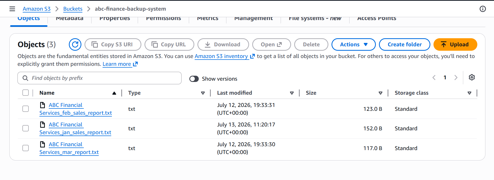
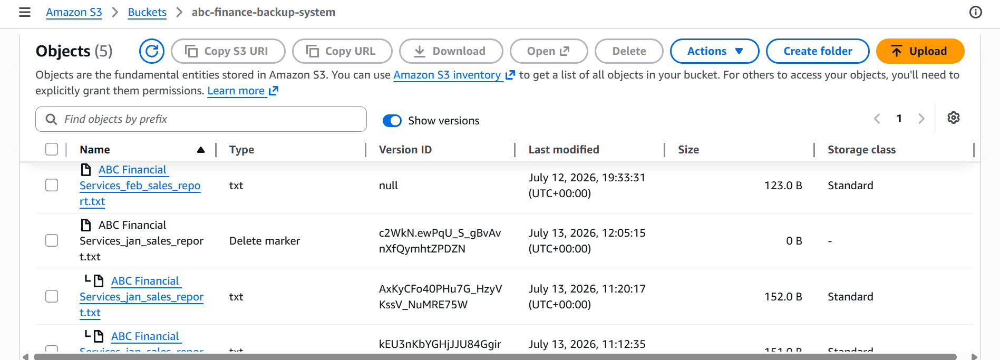
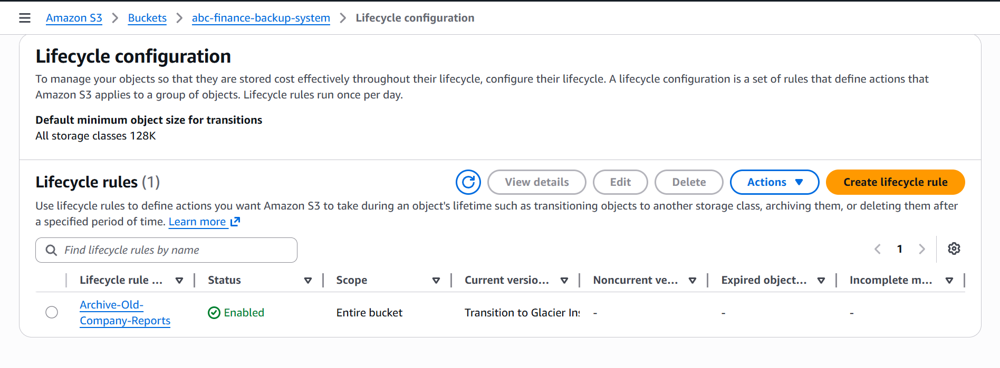

# AWS S3 Company Backup System

## Project Overview

This project demonstrates the design and implementation of a secure, reliable, and cost-effective cloud backup solution using Amazon Web Services (AWS). The solution was developed for a fictional company, **ABC Financial Services**, to simulate how organizations protect critical business documents from accidental deletion and overwriting while optimizing long-term storage costs.

Throughout this project, I applied cloud engineering best practices by implementing Amazon S3 Versioning, Lifecycle Policies, and Amazon S3 Glacier Instant Retrieval. I also documented the solution using an AWS architecture diagram, GitHub, and Git version control.

---

# Business Problem

ABC Financial Services stores monthly financial reports in the cloud. As the company grew, it encountered several challenges:

* Employees accidentally overwrote important reports.
* Files were accidentally deleted.
* Cloud storage costs continued to increase because all files remained in the S3 Standard storage class.
* The company required a reliable backup strategy while maintaining compliance with long-term record retention requirements.

Without an appropriate cloud storage strategy, these issues could result in permanent data loss, operational disruptions, and increased storage expenses.

---

# Solution

To address these challenges, I designed and implemented an AWS-based backup solution using the following services:

* Amazon S3 for secure object storage
* Amazon S3 Versioning to preserve previous versions of files
* Delete Marker recovery to restore accidentally deleted files
* Lifecycle Policies to automatically transition older files into Amazon S3 Glacier Instant Retrieval
* Git and GitHub for version control and project documentation

The solution improves business continuity, protects important company records, and reduces long-term storage costs.

---

# Solution Architecture


---

# AWS Services Used

| AWS Service                         | Purpose                                                    |
| ----------------------------------- | ---------------------------------------------------------- |
| Amazon S3                           | Stores company backup files securely                       |
| Amazon S3 Versioning                | Protects against accidental overwrites and deletions       |
| Lifecycle Policy                    | Automatically transitions older objects to cheaper storage |
| Amazon S3 Glacier Instant Retrieval | Low-cost storage for infrequently accessed reports         |
| Git                                 | Tracks project changes                                     |
| GitHub                              | Hosts project repository and documentation                 |

---

# Project Structure

```text
aws-s3-company-backup-system/

├── architecture/
│   ├── diagrams/
│   │   └── abc-s3-company-backup-architecture.png
│   └── architecture-notes.md
│
├── reports/
│   ├── January-Sales-Report.txt
│   ├── February-Sales-Report.txt
│   └── March-Sales-Report.txt
│
├── screenshots/
│
├── README.md
└── 
```

---

# Project Implementation

## Phase 1 – Created the Backup Storage

* Created a private Amazon S3 bucket.
* Enabled Block Public Access.
* Uploaded monthly company reports.
* Organized reports using folders and object storage.

### Key Learning

Amazon S3 Buckets act as containers for storing objects securely in the cloud.

---

## Phase 2 – Simulated Accidental File Overwrite

To understand the importance of backup strategies, I intentionally uploaded an incorrect version of the January Sales Report.

Original Revenue:

```
$25,000
```

Incorrect Upload:

```
Revenue: $0
```

Because Versioning was disabled, the original report could not be recovered.

### Business Lesson

Simply storing files in the cloud does not automatically protect them from accidental mistakes.

---

## Phase 3 – Enabled Amazon S3 Versioning

Versioning was enabled on the S3 bucket.

After enabling Versioning:

* Every upload creates a new object version.
* Previous versions remain stored.
* Every version receives a unique Version ID.
* Future accidental overwrites can be recovered.

### Key Learning

Versioning only protects changes made after it has been enabled.

---

## Phase 4 – Recovered Deleted Files

I simulated an accidental deletion of the January Sales Report.

Instead of permanently deleting the object, Amazon S3 created a Delete Marker.

By removing the Delete Marker, I restored the latest version of the report without using an external backup.

### Key Learning

Amazon S3 Versioning protects against both accidental overwrites and accidental deletions.

---

## Phase 5 – Implemented Lifecycle Policies

To reduce long-term storage costs, I created a Lifecycle Policy that automatically transitions files after 30 days from:

Amazon S3 Standard

↓

Amazon S3 Glacier Instant Retrieval

### Business Value

The company continues to retain important reports while significantly reducing long-term storage costs.

---

# Screenshots

## Amazon S3 Bucket



---

## Amazon S3 Versioning Enabled


---

## Delete Marker Recovery



---

## Lifecycle Policy



---

# Skills Demonstrated

## Cloud Services

* Amazon S3
* Amazon S3 Versioning
* Amazon S3 Glacier Instant Retrieval
* Lifecycle Policies

## Cloud Engineering

* Cloud Storage
* Backup Strategy
* Disaster Recovery
* Cost Optimization
* Data Protection

## Tools

* AWS Management Console
* Git
* GitHub
* Visual Studio Code
* Draw.io

---

# Key Learning Outcomes

Through this project, I learned how to:

* Design secure cloud storage solutions.
* Protect business files using Amazon S3 Versioning.
* Recover deleted files using Delete Markers.
* Implement Lifecycle Policies for automated cost optimization.
* Build and document AWS architecture diagrams.
* Use Git and GitHub for version control.
* Translate technical AWS concepts into business solutions.

---

# Challenges Encountered

During this project, I encountered several practical challenges, including:

* Learning Git and GitHub workflows.
* Understanding the difference between overwriting and versioning.
* Recovering deleted files using Delete Markers.
* Organizing project documentation professionally.

Resolving these challenges significantly improved my understanding of AWS cloud storage and cloud engineering best practices.

---

# Future Improvements

Future enhancements to this solution may include:

* Encrypting objects using AWS KMS.
* Restricting access with IAM policies.
* Configuring Cross-Region Replication (CRR).
* Sending upload notifications using Amazon SNS.
* Deploying the infrastructure using Terraform.
* Monitoring storage activity with Amazon CloudWatch.
* Recording API activity using AWS CloudTrail.

---

# Lessons Learned

This project demonstrated that cloud engineering is about much more than creating AWS resources.

Successful cloud solutions must balance:

* Security
* Reliability
* Cost Optimization
* Operational Excellence
* Business Requirements

Every AWS service should solve a real business problem rather than simply demonstrating technical capability.

---

# Author

**David Opoku Dumfeh**

Aspiring Cloud Engineer | AWS Cloud Learner | DevOps Enthusiast

**GitHub:** https://github.com/Dumfeh

**LinkedIn:** https://www.linkedin.com/in/david-opoku-dumfeh-5756a6151/

---

# Acknowledgements

This project was completed as part of my hands-on cloud engineering learning journey. It was designed to simulate real-world business scenarios while applying AWS best practices for secure cloud storage, disaster recovery, and cost optimization.
